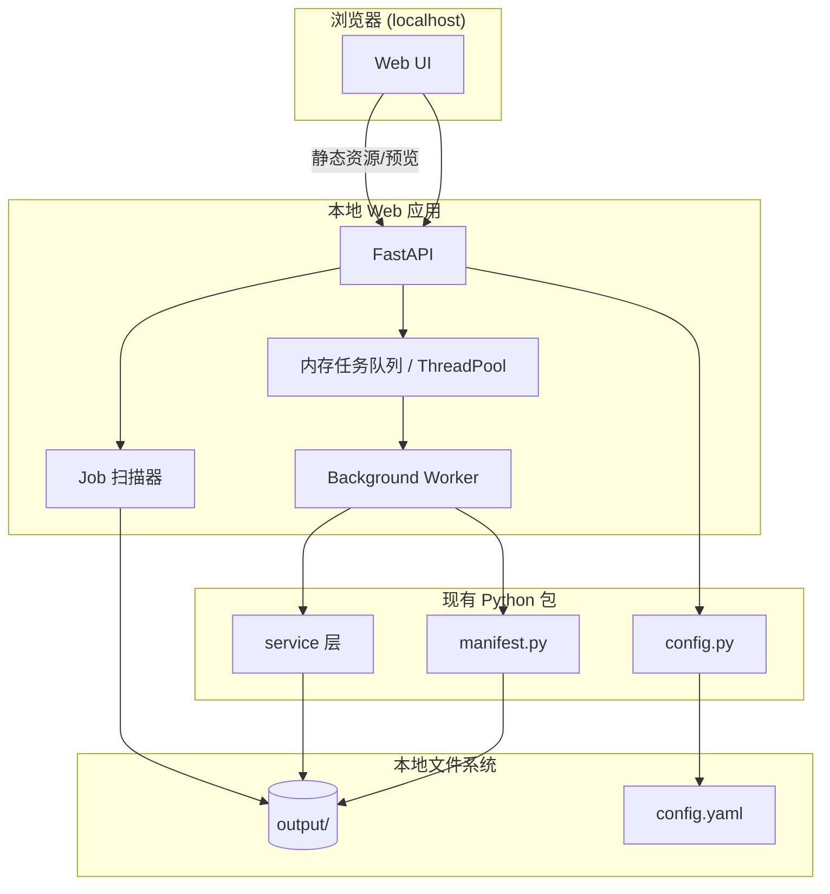

# 本地 Web 端开发计划

## 文档状态

| 项 | 说明 |
| --- | --- |
| 版本 | Draft v0.1 |
| 范围 | **仅本地运行**；不包含公网部署、多租户、生产运维 |
| 前置条件 | 现有 `vlp` CLI 与服务层（`download` / `transcribe` / `summarize`）已可用 |
| 关联文档 | [ARCHITECTURE.md](./ARCHITECTURE.md)、[manifest 参考](../skills/video-link-pipeline/references/manifest.md) |

## 1. 目标与边界

### 1.1 要做什么

在开发者本机启动一个 Web 应用，实现：

1. **可视化任务**：浏览 `output/` 下已有 job，读取 `manifest.json` 展示状态与产物
2. **提交任务**：通过 Web 表单触发下载、转录、摘要或 `run` 编排
3. **进度反馈**：长任务在后台执行，前端可查看阶段状态与诊断信息
4. **结果预览**：在线查看 transcript、summary、字幕；可选播放本地 video/audio

### 1.2 明确不做（本阶段）

- 公网服务器部署、Docker 生产编排、HTTPS、域名
- 用户注册登录、多用户隔离、RBAC
- 对象存储（S3/MinIO）替换本地磁盘
- 分布式 Worker 集群、水平扩缩容
- 重写下载/转录/摘要核心逻辑

### 1.3 设计原则

1. **复用服务层**：Web API 只编排，业务逻辑继续调用 `execute_download`、`transcribe_path`、`summarize_transcript` 等现有函数
2. **manifest 为唯一任务状态源**：与 CLI 一致，Web 不另建一套状态机；必要时仅增加轻量 `jobs` 索引表（内存或 SQLite）做任务 ID 映射
3. **本地优先**：默认绑定 `127.0.0.1`，读写项目内 `output/` 与 `config.yaml`
4. **CLI 行为不变**：Web 是增量能力，不破坏现有 `vlp` 命令与测试

## 2. 总体架构



### 2.1 与现有分层的关系

| 层级 | 现状 | Web 阶段新增 |
| --- | --- | --- |
| CLI 编排 | `cli.py` | 可选抽取 `pipeline.py` 供 CLI 与 Web 共用编排逻辑（非必须，MVP 可在 API 内薄封装） |
| 服务层 | `download/`、`transcribe/`、`summarize/` | **不改动或极少改动** |
| 基础设施 | `manifest.py`、`config.py`、`doctor.py` | API 直接调用 |
| 表现层 | Typer CLI | **新增** FastAPI + 前端 SPA |

## 3. 技术选型（建议）

### 3.1 后端

| 组件 | 建议 | 理由 |
| --- | --- | --- |
| Web 框架 | **FastAPI** | 与 Python 包同栈、OpenAPI 自动生成、类型友好 |
| 后台任务 | **本地 ThreadPoolExecutor** 或 `asyncio.to_thread` | 本地 MVP 足够；无需 Redis/Celery |
| 任务 ID | UUID + job 目录路径映射 | 简单可调试 |
| 配置 | 复用 `load_config` | 与 CLI 一致 |
| 静态文件 | FastAPI `StaticFiles` 或开发期 Vite proxy | 本地预览产物 |

可选依赖组（`pyproject.toml`）：

```toml
[project.optional-dependencies]
web = [
  "fastapi>=0.110",
  "uvicorn[standard]>=0.27",
  "python-multipart>=0.0.9",
]
```

### 3.2 前端

| 组件 | 建议 | 理由 |
| --- | --- | --- |
| 框架 | **Vue 3** 或 **React** | 按团队熟悉度二选一 |
| 构建 | **Vite** | 本地 dev server + proxy 到 API |
| UI | Element Plus / shadcn/ui 等 | 快速搭表格、表单、步骤条 |
| 状态 | 轻量 composable / hooks | MVP 不必上 Redux |
| 实时更新 | **轮询**（3–5s）或 SSE | MVP 优先轮询；manifest 文件即状态 |

### 3.3 目录规划（建议）

```text
video-link-pipeline/
├── src/video_link_pipeline/     # 现有包（服务层）
├── web/
│   ├── api/                     # FastAPI 应用
│   │   ├── __init__.py
│   │   ├── main.py              # 入口：uvicorn web.api.main:app
│   │   ├── routes/
│   │   │   ├── jobs.py          # 任务 CRUD、提交
│   │   │   ├── artifacts.py     # 产物预览、下载
│   │   │   └── health.py        # 健康检查、doctor 摘要
│   │   ├── services/
│   │   │   ├── job_runner.py    # 后台执行 pipeline
│   │   │   └── job_scanner.py   # 扫描 output/ + manifest
│   │   └── schemas/             # Pydantic 模型
│   └── frontend/                # Vite 前端工程
│       ├── src/
│       │   ├── pages/
│       │   ├── components/
│       │   └── api/             # 调用后端封装
│       └── package.json
├── docs/
│   └── web-local-dev-plan.md    # 本文档
└── scripts/
    └── dev-web.ps1              # 一键启动 API + 前端（可选）
```

## 4. 功能分期

### Phase 0：脚手架（约 2–3 天）

**目标**：本地能同时启动 API 与空白前端页。

交付物：

- [ ] `web/api` FastAPI 骨架，`GET /health` 返回 `{ "status": "ok" }`
- [ ] `web/frontend` Vite 工程，首页显示项目名与 API 连通状态
- [ ] `pip install -e .[web]` 或文档说明安装方式
- [ ] 本地启动说明（PowerShell + 可选 `scripts/dev-web.ps1`）

验收：

```bash
# 终端 1
uvicorn web.api.main:app --reload --host 127.0.0.1 --port 8765

# 终端 2
cd web/frontend && npm run dev
```

浏览器访问 `http://localhost:5173`，能看到 API 健康检查结果。

---

### Phase 1：只读任务看板（约 3–5 天）

**目标**：不提交新任务，仅可视化已有 `output/` job。

交付物：

- [ ] `JobScanner`：递归扫描 `output_dir`（来自 config），发现含 `manifest.json` 的 job 目录
- [ ] `GET /api/jobs`：任务列表（id、标题、command、updated_at、各阶段 success 摘要）
- [ ] `GET /api/jobs/{id}`：完整 manifest + 解析后的阶段状态
- [ ] 前端：任务列表页 + 任务详情页
  - 展示 `execution.download` / `transcribe` / `summarize`
  - 展示 `warning_details`、`hint`、`fallback_context`（下载诊断）
  - 展示 `artifacts` 文件列表

数据映射（前端状态条）：

| manifest 字段 | UI 展示 |
| --- | --- |
| `execution.download.success` | 下载阶段 ✓/✗ |
| `execution.transcribe.success` | 转录阶段 ✓/✗/跳过 |
| `execution.transcribe.reused_existing` | 标签「复用已有转录」 |
| `execution.summarize.success` | 摘要阶段 ✓/✗/跳过 |
| `command` | 最后更新步骤 |
| `input.url` / `input.input_path` | 任务来源 |

验收：

- 先用 CLI 跑 1–2 个 job：`vlp download-subs ...`、`vlp run ... --do-transcribe`
- Web 看板能列出这些 job，详情页字段与 `manifest.json` 一致

---

### Phase 2：Web 提交任务 + 后台执行（约 5–7 天）

**目标**：在本地通过 Web 创建任务，后台调用现有 service 层。

交付物：

- [ ] `POST /api/jobs`：创建任务
  - 支持类型：`download` | `download-subs` | `transcribe` | `summarize` | `run`
  - 请求体：url / input_path、可选 flags（与 CLI 对齐）
- [ ] `JobRunner`：线程池执行，执行顺序复用 `cli.run_command` 逻辑（建议抽取共享函数，避免复制粘贴）
- [ ] 任务运行时状态：`queued` | `running` | `succeeded` | `failed`（内存字典；持久化仍以 manifest 为准）
- [ ] `GET /api/jobs/{id}/status`：合并内存状态 + 磁盘 manifest
- [ ] 前端：新建任务表单、提交后跳转详情页并轮询

API 请求示例：

```json
POST /api/jobs
{
  "type": "run",
  "url": "https://www.bilibili.com/video/BV...",
  "options": {
    "do_transcribe": true,
    "do_summary": false,
    "cookies_from_browser": "chrome",
    "selenium": "auto"
  }
}
```

执行约束：

- 同一时刻默认 **1 个** pipeline 任务（本地机器资源有限，可配置 `max_workers=1`）
- 失败时保留 manifest 中间状态（与 CLI 行为一致）
- 捕获 `VlpError`，写入 API 响应与 manifest

验收：

- Web 提交 B 站链接 `download-subs`，后台成功写出 manifest 与字幕文件
- Web 提交 `run --do-transcribe`，详情页可看到阶段逐个变绿
- CLI 与 Web 交叉验证：Web 创建的任务目录，CLI 可读 manifest；CLI 创建的任务，Web 看板可见

---

### Phase 3：产物预览与体验打磨（约 3–5 天）

**目标**：在浏览器内直接查看结果，减少切文件夹成本。

交付物：

- [ ] `GET /api/jobs/{id}/artifacts/{name}`：按 manifest 中路径安全读取文件（防路径穿越）
- [ ] 文本预览：transcript.txt、summary.md、subtitle.srt/vtt、keywords.json
- [ ] 媒体预览：video.mp4、audio.m4a（HTML5 `<video>` / `<audio>`，Range 请求可选）
- [ ] 前端：Tab 切换预览、Markdown 渲染 summary、JSON 折叠展示 keywords
- [ ] `GET /api/doctor`：封装 `run_checks`，设置页展示环境摘要（FFmpeg、Selenium、cookies）

安全注意（即便本地也建议做）：

- artifact 路径必须解析为 `job_dir` 的子路径
- 禁止 `..` 与绝对路径逃逸

验收：

- 详情页可预览 transcript 与 summary，无需打开资源管理器
- doctor 信息可在 Web 设置/诊断页查看

---

### Phase 4：增强（可选，本阶段不阻塞 MVP）

- 任务日志流：`GET /api/jobs/{id}/logs`（tail 内存 ring buffer）
- SSE 推送 manifest 变更，替代轮询
- 从 Web 上传本地视频/音频触发 `transcribe`
- 从 Web 上传 `cookies.txt`（存到项目 temp，仅本地使用）
- 抽取 `pipeline/orchestrator.py`，CLI 与 Web 共用编排代码
- 基础 E2E 测试（Playwright）：提交 job → 等待完成 → 断言 manifest

## 5. API 设计摘要

### 5.1 端点列表（MVP）

| 方法 | 路径 | 说明 |
| --- | --- | --- |
| GET | `/health` | 健康检查 |
| GET | `/api/config/effective` | 当前有效配置摘要（脱敏 API key） |
| GET | `/api/doctor` | 环境诊断摘要 |
| GET | `/api/jobs` | 任务列表 |
| GET | `/api/jobs/{id}` | 任务详情（manifest） |
| POST | `/api/jobs` | 创建并异步执行任务 |
| GET | `/api/jobs/{id}/status` | 运行态 + manifest 摘要 |
| GET | `/api/jobs/{id}/artifacts/{artifact_key}` | 读取产物（按 manifest artifacts 键名） |

### 5.2 Job 列表项 Schema（示例）

```json
{
  "id": "3fa85f64-5717-4562-b3fc-2c963f66afa6",
  "job_dir": "output/bilibili/BV1xx-demo-title",
  "title": "demo-title",
  "source_url": "https://...",
  "command": "vlp run",
  "updated_at": "2026-06-10T12:00:00Z",
  "stages": {
    "download": { "success": true, "status": "done" },
    "transcribe": { "success": true, "reused_existing": false, "status": "done" },
    "summarize": { "success": null, "status": "skipped" }
  },
  "runtime_status": "succeeded"
}
```

### 5.3 任务发现策略

1. **扫描模式**（Phase 1 起）：遍历 `config.output_dir`，凡含 `manifest.json` 的目录即 job
2. **注册模式**（Phase 2 起）：Web 创建任务时生成 UUID，写入内存 `job_registry.json`（可选持久化到 `.web/jobs.json`）映射 `id → job_dir`
3. CLI 手动创建的任务：扫描模式自动出现在看板，无需注册

## 6. 前端页面规划

| 页面 | 路由 | 功能 |
| --- | --- | --- |
| 任务看板 | `/` | 列表、筛选（成功/失败/进行中）、刷新 |
| 任务详情 | `/jobs/:id` | 阶段时间线、诊断码、产物列表、预览区 |
| 新建任务 | `/jobs/new` | 表单：类型、URL/路径、选项（对齐 CLI flags） |
| 环境诊断 | `/settings` | doctor 结果、output 目录、config 来源 |

### 6.1 任务详情页线框（逻辑）

```text
┌─────────────────────────────────────────────────────┐
│  BV1xx-demo-title                    [运行中/成功/失败] │
│  https://...                                         │
├─────────────────────────────────────────────────────┤
│  [下载 ✓] ──→ [转录 ✓] ──→ [摘要 —]                  │
├─────────────────────────────────────────────────────┤
│  诊断                                               │
│  · primary_http_403 / hint: ...                     │
│  · fallback_context.extraction_kind: window_state   │
├─────────────────────────────────────────────────────┤
│  产物  [transcript] [summary] [subtitle] [video]    │
│  ┌──────────────── preview ────────────────┐         │
│  │                                         │         │
│  └─────────────────────────────────────────┘         │
└─────────────────────────────────────────────────────┘
```

## 7. 本地开发与运行

### 7.1 环境要求

与 CLI 相同，另加：

- Node.js 18+（前端）
- `pip install -e .[web,selenium,dev]`（按实际需要）

### 7.2 推荐启动流程

```powershell
# 1. 安装
pip install -e ".[web,dev]"
cd web/frontend; npm install; cd ../..

# 2. 启动 API（项目根目录）
uvicorn web.api.main:app --reload --host 127.0.0.1 --port 8765

# 3. 启动前端
cd web/frontend
npm run dev
```

前端 `vite.config` 代理示例：

```ts
server: {
  proxy: {
    '/api': 'http://127.0.0.1:8765',
    '/health': 'http://127.0.0.1:8765',
  },
}
```

### 7.3 配置约定

- Web 默认读取项目根目录 `config.yaml`
- 不在 Web 阶段引入第二套配置文件；可选环境变量 `VLP_WEB_HOST` / `VLP_WEB_PORT` 仅控制绑定地址
- `output_dir` 与 CLI 共用，避免「CLI 跑了 Web 看不到」

## 8. 测试策略

| 层级 | 内容 |
| --- | --- |
| API 单元测试 | `JobScanner` 扫描逻辑、路径安全校验、manifest 解析 |
| API 集成测试 | `TestClient` + mock `execute_download`，断言 POST /jobs 行为 |
| 回归 | 现有 `pytest` 全量通过；Web 代码不破坏 CLI 测试 |
| 手工 | Windows 本机：B 站 download-subs、run + transcribe、失败任务 manifest 保留 |

不建议 Phase 0–2 强依赖 Playwright；Phase 4 再补 E2E。

## 9. 风险与对策

| 风险 | 影响 | 对策 |
| --- | --- | --- |
| CLI 编排逻辑复制到 API 导致漂移 | 双份 bug | Phase 2 优先抽取 `orchestrator` 或 API 内直接调用 cli 私有函数的重构版 |
| 长任务阻塞 API 进程 | 界面卡死 | 必须线程池/子进程；HTTP 立即返回 job id |
| Windows 路径与中文 job 名 | 预览失败 | 统一 `pathlib`；API 返回 URL 编码路径 |
| 浏览器 cookies 仍依赖本机 Chrome | 下载失败 | Web 表单提示「先关浏览器」；doctor 链到设置页 |
| 转录占满 CPU/GPU | 机器卡顿 | 默认单任务；前端提示预计耗时 |
| manifest 与内存状态不一致 | 状态显示错误 | 以 manifest 为准；内存只表示 queued/running |

## 10. 里程碑与时间估算

| 阶段 | 工期（单人，熟悉项目） | 累计 |
| --- | --- | --- |
| Phase 0 脚手架 | 2–3 天 | 3 天 |
| Phase 1 只读看板 | 3–5 天 | 8 天 |
| Phase 2 提交任务 | 5–7 天 | 15 天 |
| Phase 3 预览打磨 | 3–5 天 | 20 天 |
| Phase 4 增强（可选） | 按需 | — |

**MVP 定义**：完成 Phase 0 + 1 + 2，即可在本地 Web 提交任务并查看 manifest 驱动的状态。

## 11. 完成定义（Definition of Done）

本地 Web MVP 视为完成当且仅当：

1. 仅绑定 `127.0.0.1`，文档说明如何启动 API + 前端
2. 能列出 CLI 与 Web 创建的 job，详情与 `manifest.json` 一致
3. 能通过 Web 成功触发至少：`download-subs`、`transcribe`（本地文件）、`run --do-transcribe`
4. 失败任务在 Web 上可见 `execution.*.error_code` 与 `hint`
5. 不修改现有 CLI 对外行为；`pytest` 仍全部通过
6. README 增加「本地 Web 开发」简短入口，指向本文档

## 12. 后续扩展（不在本文档实施）

当本地 Web 稳定后，另开「服务器部署计划」文档，再考虑：

- Redis + Celery 队列
- Docker Compose / systemd
- 认证与多用户
- 对象存储与 CDN
- headless Chrome 与 cookies 运维策略

---

## 附录 A：建议优先抽取的共享模块（Phase 2 前）

为避免 `cli.py` 与 Web API 重复编排，建议在 Phase 2 实施时新增（命名可调整）：

```text
src/video_link_pipeline/pipeline/
├── __init__.py
└── orchestrator.py   # run_pipeline, run_download, run_transcribe, run_summarize
```

`orchestrator.py` 接收 `ConfigBundle` 与参数 dict，返回 `{ manifest_path, results }`；`cli.py` 与 `web/api/services/job_runner.py` 均调用它。

## 附录 B：与 manifest 字段的对齐清单

Web 详情页必须支持展示的 manifest 区块（参见 [manifest.md](../skills/video-link-pipeline/references/manifest.md)）：

- [ ] `schema_version`、`created_at`、`updated_at`
- [ ] `command`、`input`
- [ ] `artifacts.*`
- [ ] `execution.download`（含 `warning_details`、`fallback_context`）
- [ ] `execution.transcribe`（含 `reused_existing`）
- [ ] `execution.summarize`（含 `reused_existing`）
- [ ] `config_effective`（可折叠，API key 脱敏）
